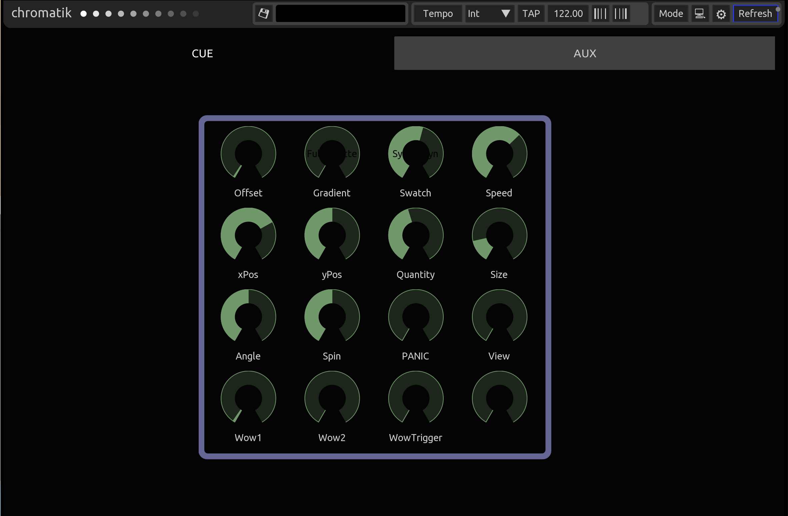
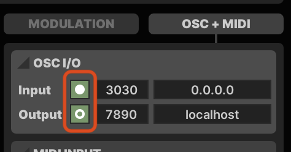
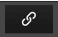
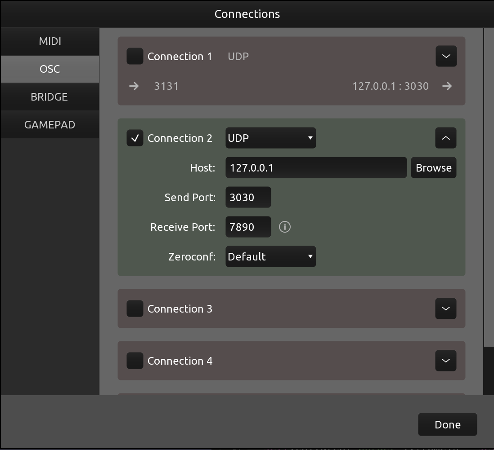
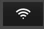
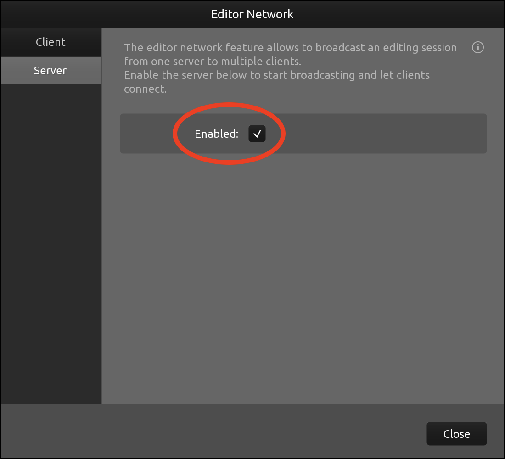
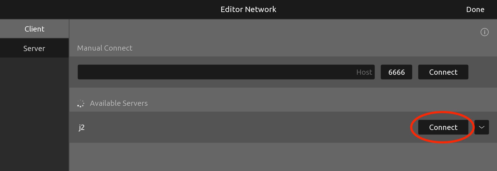

# TouchOSC layout for Chromatik / LX Studio

TouchOSC layout by Justin Belcher

Chromatik and LX Studio by Mark Slee, Heron Arts LLC

---

This project is an extension of the LX Studio software library and carries the LX Studio License. By using LX, you agree to the terms of the LX Studio Software License and Distribution Agreement, available at: [http://lx.studio/license](http://lx.studio/license)

Please note that the LX license is not open-source. The license allows for free, non-commercial use.

HERON ARTS MAKES NO WARRANTY, EXPRESS, IMPLIED, STATUTORY, OR OTHERWISE, AND SPECIFICALLY DISCLAIMS ANY WARRANTY OF MERCHANTABILITY, NON-INFRINGEMENT, OR FITNESS FOR A PARTICULAR PURPOSE, WITH RESPECT TO THE SOFTWARE.

---

## Installation

1. In LX / Chromatik in the right pane, click the OSC+MIDI tab and be sure you have enabled OSC input and output. 

    

2. Download & Install [TouchOSC (Mk2) for desktop](https://hexler.net/touchosc#get)

3. You may need to purchase the $25 lifetime license for TouchOSC.

4. Clone/Download this repo and open `chromatik.tosc`

5. Toolbar > Connections  > Enable an OSC connection matching your LX OSC settings:

   

6. Toolbar > Editor Network  > Server > Enabled.  *This needs to be done each time you restart the desktop application.*

    

7. Install & Launch TouchOSC (Mk2) on your tablet device.  Be sure you are on the same local network as the desktop.

8. Repeat step 4 to create an OSC connection to the desktop LX instance.

9. Click the Editor Network icon > Available Servers > Connect on your desktop TouchOSC instance.

    

10. The application should launch.  If it does not, click the Play icon in the toolbar.  To exit the application click the top right circle icon.

